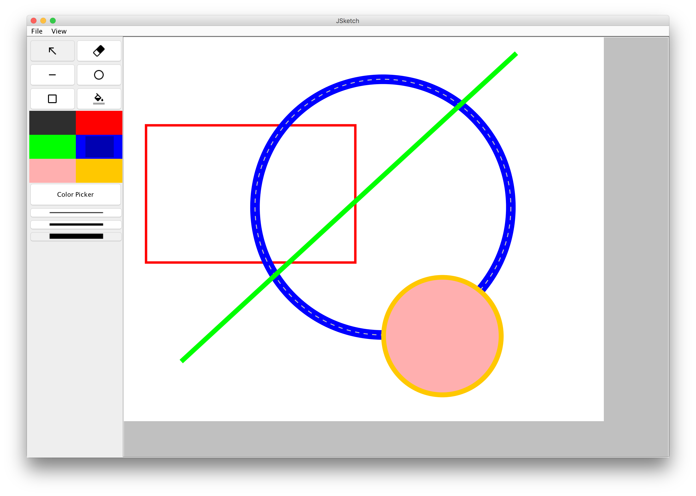

# JSketch (Java)

A very simple drawing application developed in Java. Allows users to draw rectangles, lines, circles of varying thicknesses and colours. Also supports moving shapes around, and saving the canvas as a file. 

This was my submission University of Waterloo's CS349 (User Interfaces) assignment 2. 

## Screenshots

## Running 

To run the application, go into the root folder and run "make run"

## Notes

This was developed on MAC OSX EL CAPITAN with Java version 1.8.0_92

I chose to implement the "Dynamic use of widgets" enhancement. In particular, if you change the height of the window below the line pallete height, the line pallete elements will shrink into a dropdown menu. The same applies for the colour selection tools.

## Icons

The icons used for the tools are the material design icons produced by google. See https://design.google.com/icons/ for the icons
The icons are licensed under Creative Commons Attribution 4.0 International License (CC-BY 4.0) (http://creativecommons.org/licenses/by/4.0/)
